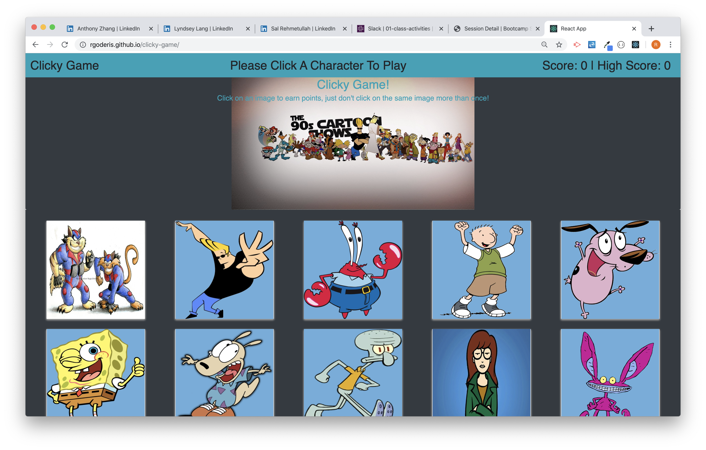

# Clicky Game
Clicky Game is a memory game built with React and JavaScript.
This game utilizes React for a faster user experience as well as for cleaner code.

### How the game works
Each character card has a boolean value of it has been clicked.  When the player clicks on a character that value updates to true and the score increases.  If the value of clicked is already true, the user score is compared to the high score to see if there is a new high score and score is reset to 0.  After each click all each character card is assigned a new index through a function and are re-displayed to the player in a rearranged order.

### Try Out Clicky Game
[Clicky Game](https://rgoderis.github.io/clicky-game/)
